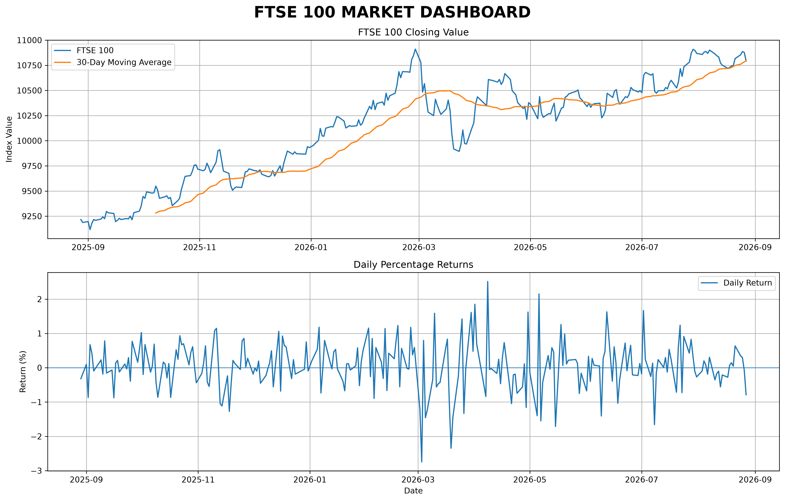

# MarketLens

## Overview

A Python-based financial data analysis project that collects, analyses and visualises real-world financial market data.

The project analyses the FTSE 100 and investigates its relationship with GBP/USD and Bitcoin using statistical and financial risk measures.

## Features

* Downloads real-time and historical financial data
* Analyses FTSE 100 performance
* Calculates average, highest and lowest closing values
* Calculates daily and annualised volatility
* Identifies the best and worst trading days
* Calculates a 30-day moving average
* Identifies short-term market trends
* Calculates maximum drawdown
* Calculates a Sharpe ratio
* Compares FTSE 100 with GBP/USD
* Compares FTSE 100 with Bitcoin
* Calculates correlations between financial assets
* Analyses daily percentage returns
* Generates financial data visualisations
* Produces a market dashboard

## Technologies Used

* Python
* Pandas
* NumPy
* Matplotlib
* yfinance
* CSV data

## Key Findings

During the period analysed:

* **FTSE 100 overall change:** 17.1%
* **FTSE 100 annualised volatility:** 11.33%
* **Maximum drawdown:** -9.32%
* **Sharpe ratio:** 1.09
* **FTSE 100 / GBP/USD correlation:** 0.25
* **FTSE 100 / Bitcoin price correlation:** -0.88
* **FTSE 100 / Bitcoin daily-return correlation:** 0.17

The difference between the Bitcoin price correlation and daily-return correlation demonstrates why analysing percentage returns can provide a more meaningful measure of the relationship between financial assets.

## Dashboard

The project includes a dashboard visualising FTSE 100 performance, its 30-day moving average and daily percentage returns.



## Project Structure

```text
MarketLens/
│
├── .gitignore
├── README.md
│
├── market_data.py
├── analyse_data.py
├── report.py
├── dashboard.py
├── interest_rates.py
├── bitcoin_data.py
│
├── ftse100_history.csv
├── gbpusd_history.csv
├── bitcoin_history.csv
│
└── ftse100_dashboard.png
```

## How to Run

### 1. Install Python

Make sure Python 3.13 or later is installed.

### 2. Install the required libraries

Open a terminal in the project folder and run:

```bash
pip install pandas numpy matplotlib yfinance
```

### 3. Run the project

Run the scripts in the following order:

```bash
python market_data.py
python analyse_data.py
python bitcoin_data.py
python dashboard.py
python report.py
```

The scripts download financial data, analyse market performance and generate financial statistics and visualisations.

## Purpose

This project was developed to build practical skills in:

* Financial data analysis
* Python programming
* Data visualisation
* Statistical analysis
* Financial markets
* Economic indicators
* Risk analysis

## Future Improvements

Possible future developments include:

* Adding UK inflation data
* Adding UK interest-rate data
* Adding additional stock-market indices
* Building an interactive dashboard
* Automating data updates
* Using a live risk-free rate
* Comparing multiple investment portfolios
* Adding portfolio optimisation techniques
